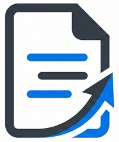

# Darig

Darig is a suite of tools that streamline data management of structured data in YAML.

These tools include:
 - [Darig Schema](./src/darig/schema/README.md) - Data validation and schema enforcement
 - [Darig Query](./src/darig/query/README.md) - Query your YAML using standard SQL queries

## Vision & Inspiration

Teams and organizations often manage a diverse, complex set data as they collaborate to achieve their objectives.
This data is commonly persisted in a database.
When the data evolves rapidly (i.e. has high transaction rates), this makes sense.
But often our data may be considered 'semi-static', changing infrequently over time.
Visibility into and integrity of changes to this 'semi-static' data as it evolves can be valuable.
What changed?
Who made the change?
Was the change valid?
Establishing this visibility within databases can become complex and costly.

The vision of darig is to allow for 'semi-static' data to be persisted in structured human and machine readable files that can be validated for correctness and referential integrity.
We see clear examples of this concept in infrastructure-as-code tools.
darig seeks to explore that paradigm for data in a highly flexible manner, suitable for a variety of domains.
This would allow teams to leverage robust version control systems to rigorously manage change.
Teams can create automations to ensure data validity and integrity.
And this could be done without compromising the common user experiences teams are accustomed to when working with their data.

darig attempts to enable this by providing robust solutions for defining and validating data structure and integrity through schemas in the `darig` tool.
The `darig` tool builds upon this by providing a query language and database fascade for your data.
Over time additional tools will be added to support other use cases and streamline development of products that utilize this 'semi-static' data management concept.


## Developer Setup

Darig is written in python and managed with the `UV` tool.

- Install UV:
    ```bash
    curl -LsSf https://astral.sh/uv/install.sh | sh
    ```
- Clone the darig repo
    ```bash
    git clone git@github.com:Vibe1NG/darig.git
    cd darig
    ```

- Setup the virtual environment and install dependencies
    ```bash
    uv venv
    source .venv/bin/activate
    uv pip install -e .[dev]
    ```

- Run tests
    ```bash
    uv run pytest
    ```

- Run tests w/ coverage
    ```bash
    uv run pytest
    ```

- Run linter
    ```bash
    uv run ruff check .
    ```

- Run formatter
    ```bash
    uv run ruff format .
    ```

- Run type checks
    ```bash
    uv run pyright
    ```

Use the standard github-flow working process to best leverage feedback from the CI process.

To Perform a release:
- Update the version in `pyproject.toml`
- Complete and merge the pull request to main.
- Get on the main branch:
    ```bash
    git checkout main
    git pull origin main
    ```
- Tag and push the repo:
    ```bash
    git tag "v$(uv run python -c "import toml; print(toml.load('pyproject.toml')['project']['version'])")"
    git push --tags
    ```